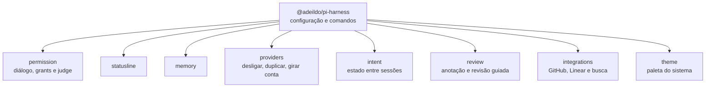
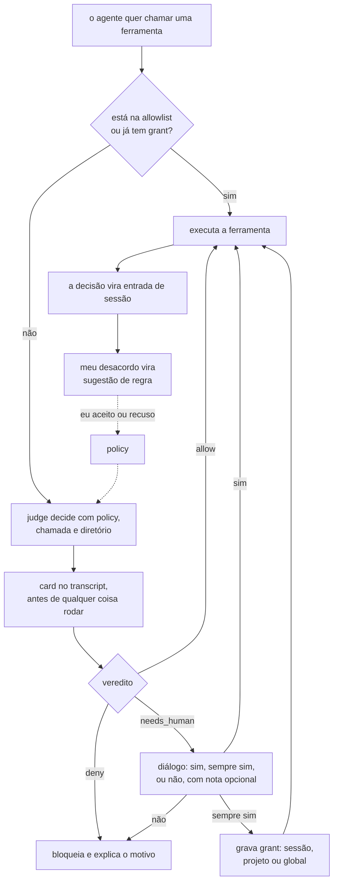
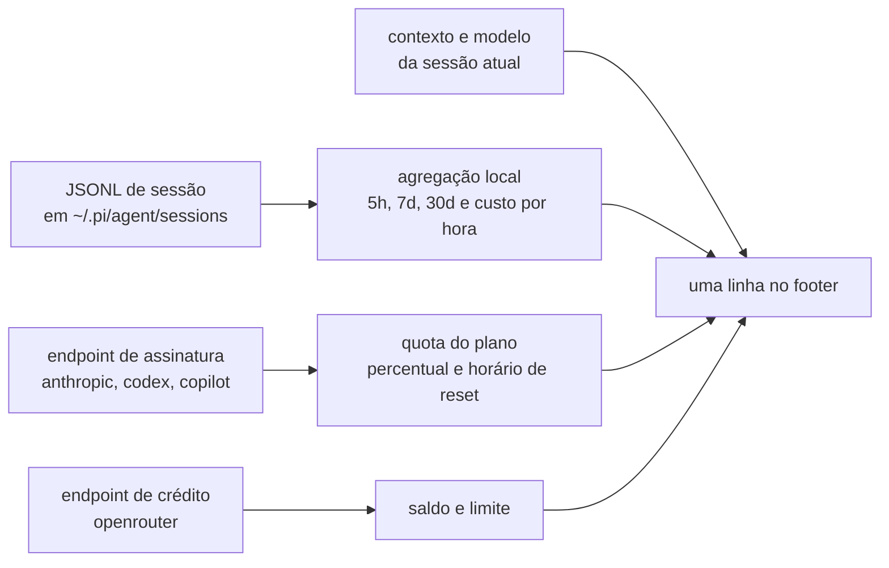
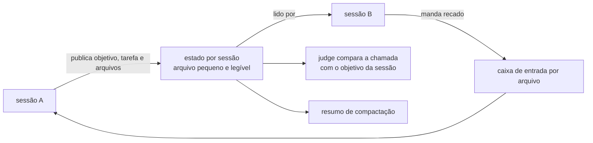
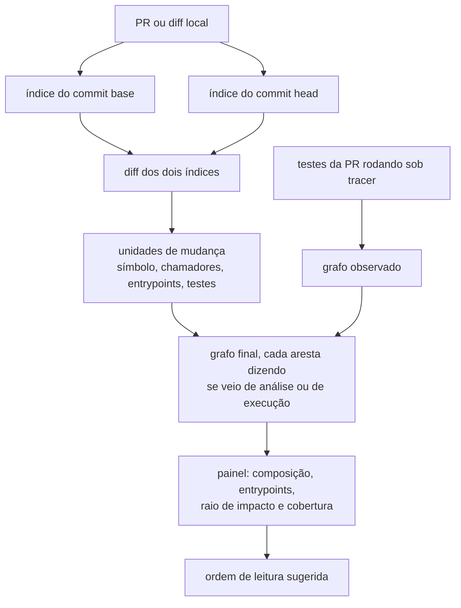

# IDEA.md

Anotações do que eu quero construir em cima do pi. Não é especificação, não é README, não é proposta para ninguém aprovar. É onde eu junto as ideias antes de decidir o que fazer primeiro.

Como ler. A parte 1 são os princípios que filtram o resto. A parte 2 é o ponto de partida, o que já existe e o que eu uso hoje. A parte 3 são as peças, cada uma com o problema que resolve e, quando eu já conferi, com o dado concreto. A parte 4 é ordem, riscos e o que eu não quero. Os diagramas são mermaid.

## Parte 1. Princípios

### O que eu quero construir

Um conjunto de extensões minhas, publicadas juntas, com configuração que eu escolhi. O pi continua sendo o pi. O que eu instalo por cima é a minha opinião sobre permissão, memória, resumo, multi conta, agentes e statusline.

Nome provisório: `@adeildo/pi-harness`. O nome é a parte fácil de trocar.

Não quero fork. Fork me obriga a acompanhar o pi a cada release, e eu prefiro gastar essa energia em funcionalidade. Quero poder desinstalar e voltar ao pi cru sem perder nada.

### Humano no meio

Eu julgo melhor que o agente e o agente produz mais rápido que eu. Isso não muda tão cedo. Então o problema de projeto não é tirar o humano da decisão, é fazer a decisão dele chegar a tempo.

Na prática, encurtar a distância entre o agente fazer e eu entender o que ele fez. Um card que mostra o veredito do judge antes do comando rodar. O estado da sessão publicado em algum lugar. Um resumo estruturado no fim do turno. São três formas de eu acompanhar sem ler a conversa inteira.

Delegar não é remover o humano, é gastar menos atenção por chamada. O judge existe para eu não olhar cada comando, e o tempo que ele economiza precisa sobrar em atenção em outro lugar. Automação que existe só para me tirar da frente está errada mesmo quando funciona.

Confiança vem de resolver um problema que eu tenho hoje, e de responder uma pergunta simples: por que isso existe em vez de eu fazer na mão. Se a resposta é porque é mais elegante, a funcionalidade morre. Se a resposta é porque eu faço isso dez vezes por dia e perco dois minutos em cada uma, ela entra, e mostra o número.

Duas regras práticas para qualquer tela de decisão. Eu preciso da informação para decidir, não do resumo do que o agente achou. E tudo que decide por mim tem que ser visível e reversível, porque confiança que depende de fé não sobrevive ao primeiro erro.

Passando as peças deste arquivo por esse filtro. A statusline existe para eu não precisar perguntar onde estou. O card do judge existe para aprovar não ser cara ou coroa. O estado de intent existe para eu retomar uma sessão sem reler o histórico. O uso por projeto existe porque a decisão de custo é minha. A policy que aprende só sugere porque a política é minha. A revisão guiada existe para eu não ler 400 linhas sem saber por onde começar. Se alguma ideia daqui não passar nesse teste, ela é a próxima a sair.

### Perguntar em vez de adivinhar

Esta é a ferramenta do princípio acima. O agente pergunta em vez de chutar, e cada chute evitado é tempo que eu não gasto desfazendo suposição errada. Ela já existe como pacote separado, o `@juicesharp/rpiv-ask-user-question`, e funciona bem. É justamente por isso que reescrever é uma decisão cara.

O que ela faz hoje, para eu não redescobrir:

- uma ferramenta só, `ask_user_question`, com até quatro perguntas num diálogo com abas
- opções escritas, cada uma com uma linha dizendo o que significa ou quanto custa
- uma linha de resposta própria sempre presente, com rascunho multilinha que sobrevive quando eu navego para outra opção, `Shift+Enter` para quebrar linha, `Ctrl+G` para abrir o editor externo do pi e `Ctrl+U` para limpar
- nota por pergunta e uma nota geral para o questionário inteiro, chegando ao modelo como `user notes:` e `global note:`, e nenhuma das duas marca a pergunta como respondida
- aba de envio que lista minhas respostas e aponta o que ficou em branco antes de fechar
- painel de prévia markdown ao lado das opções, com o código, o diagrama ou o exemplo que a opção carrega, precisando de 100 colunas para ficar ao lado e passando para baixo delas em terminal estreito
- tecla para recolher o diálogo e ler o transcript atrás, voltando depois com as respostas intactas
- sinal sonoro quando o questionário começa a me esperar
- configuração em `~/.config/rpiv-ask-user-question/config.json`, só lida e nunca escrita, com a tecla de recolher e três campos que reescrevem a orientação dada ao modelo, o que ajusta como e quando ele pergunta
- fora do terminal o agente não vê a ferramenta, e em RPC ou ACP ela usa os diálogos nativos do anfitrião
- não faz chamada de modelo nenhuma, tem nove idiomas com pt-BR incluso, umas 4 mil linhas e licença MIT

Mesmo assim eu quero ela dentro do meu conjunto, por quatro motivos.

A resposta precisa virar artefato durável. Hoje ela volta para o modelo como texto e o diálogo fecha. Ela também deveria virar entrada de sessão, para a decisão ficar auditável, sobreviver a compactação e alimentar a policy que aprende. É o sinal de feedback mais barato que existe, porque eu já respondi, e hoje ele evapora.

Precisa existir um canal só. O judge já quer me perguntar coisas e hoje isso vai pelo diálogo de permissão, que tem outras teclas e outro formato. Unificado, a dúvida do judge chega com opções, nota e prévia como qualquer outra pergunta, e a resposta é registrada do mesmo jeito.

A prévia pode ser artefato de verdade. Hoje o painel desenha markdown, mas o TUI do pi desenha imagem e diff. Então a prévia pode ser uma captura de tela de antes e depois, ou um pedaço de diff, que é exatamente o que as duas seções de revisão pedem.

E tem a tecla morta. O padrão para recolher o diálogo é `ctrl+]`, e em teclado ABNT o `]` fica na camada com shift. Para mim, hoje, ela não faz nada. Dá para configurar, mas o padrão deveria funcionar, e a ferramenta poderia avisar na primeira execução em vez de deixar a tecla quebrada em silêncio.

O contra-argumento é forte e eu quero ele registrado. Reescrever 4 mil linhas de código MIT que já resolvem layout de prévia, reconciliação depois de retomar sessão, caminho alternativo de RPC e nove idiomas é trabalho de meses sem ideia nova. E o pacote publica contrato de evento estável, com nome de canal que não muda e payload que só cresce, incluindo um evento que dispara enquanto o questionário espera por mim.

Então a ordem é adotar primeiro, forkar depois, reescrever quase nunca. Primeiro eu assino os eventos públicos e registro as respostas como entrada de sessão, o que me dá o artefato durável sem encostar no código de ninguém. Depois, quando eu esbarrar em prévia tipada ou em canal unificado com o judge, eu fork o pacote para dentro do monorepo e mudo o que precisa. Do zero só se o fork apodrecer, e nesse dia eu mantenho as partes boas, que são a linha de resposta própria, a aba que denuncia o que ficou em branco e as notas.

Métricas, porque o valor disso é proporcional a quanto é barato eu responder: tempo até eu responder, quantas vezes eu uso a resposta própria, e quantas vezes minha resposta contraria o que o modelo recomendou. A última é o modelo prestes a chutar errado, e é matéria-prima da policy que aprende.

## Parte 2. Ponto de partida

### O que já existe

O `pi-ask-permission` está na 1.2.0 e faz: diálogo de permissão com nota de followup, always yes com escopo de sessão, projeto e global, allow e deny por configuração, judge com policy em texto livre, dois backends de judge, cards no transcript, tela de settings e comandos. São umas 2 mil linhas em `src/`.

Dois problemas recentes que mostram onde mora o trabalho de verdade. Uma sessão antiga derrubava o pi inteiro ao retomar, porque o formato do card mudou no meio do caminho e o renderizador não tolerava o formato velho. E o card só aparecia depois do comando rodar, porque ele esperava o fim do turno. Nenhum dos dois é a funcionalidade principal do pacote, e os dois eram bugs de verdade.

### Extensões de terceiros que eu uso

Quatro pacotes, todos carregados pelo pi: `pi-multiprovider`, `pi-hide-providers`, `pi-web-access` e `@juicesharp/rpiv-ask-user-question`. Dois deles cobrem terreno que eu quero dentro do conjunto, então essa é uma das primeiras decisões do monorepo: absorver, configurar ou deixar de fora. Absorver tudo é o caminho mais rápido para um pacote que ninguém consegue instalar em pedaço.

### Forma do repo

Monorepo, com um pacote por assunto e um pacote raiz que junta tudo com uma configuração só.



Os pacotes compartilham uma base pequena: leitura das sessões gravadas, consulta de quota dos provedores e âncora de símbolo. Ler os arquivos de sessão para calcular uso serve a três coisas ao mesmo tempo, que são a statusline, o uso por projeto e o roteador de modelo. É por isso que monorepo agora e não depois. Fazer isso três vezes em três repositórios é pedir para divergir.

Versionamento por pacote com release-please e publicação por OIDC, que é o fluxo que o pacote de permissão já usa e já está provado.

## Parte 3. As peças

### Permissão e judge

O que roda hoje, quando o agente quer executar alguma coisa. Se o comando está na allowlist ou já tem grant, executa direto. Senão o judge decide, usando a policy, a chamada e o diretório do projeto. O veredito pode ser permitir, negar ou pedir para humano decidir. O card aparece no transcript no instante da decisão, antes de qualquer coisa rodar, e o diálogo só abre quando o veredito é pedir para humano.



O que falta. O judge recebe policy, chamada e diretório, e mais nada. Ele já teve um sinal de intenção, comparando a chamada com a última mensagem do usuário, e isso foi removido porque a fonte era fraca: a última mensagem quase nunca diz o que aquela chamada serve. Com objetivo e plano publicados pela sessão, como descrevo na seção de intent, o sinal de intenção volta a ter o que comparar.

Outra ideia que eu quero testar: judge em dois níveis. Um modelo barato decide o caso fácil, e quando a confiança fica perto do limiar ou o risco passa do teto, escala para o modelo caro. Hoje cada chamada de ferramenta custa uma consulta.

### Policy que aprende com feedback

A policy hoje é texto que eu escrevo. Eu quero que ela evolua com o meu uso, e o cuidado todo está na palavra evolua.

Três sinais existem sem inventar nada: o judge pediu e eu neguei, o judge pediu e eu respondi sempre sim, e o judge aprovou sozinho e eu reclamei depois. O segundo já é aprendizado hoje, é o grant. O primeiro é o interessante, porque é onde eu discordo dele.

O desenho que eu imagino. Contar desacordos por padrão de chamada. Quando o mesmo padrão se repetir, propor uma regra nova para a policy, explicando em que casos ela nasceu. Propor, nunca aplicar sozinho. Uma regra sugerida aparece para eu aceitar ou recusar, e nada muda sem essa resposta.

O risco é overfitting, regra que nasce de dois casos parecidos e quebra dez outros. Duas defesas. Antes de mostrar a sugestão, medir contra as decisões passadas e dizer quantas ela teria mudado, incluindo as que ficariam piores. E colocar teto de regras com data de validade, porque regra que ninguém usa há meses atrapalha. Se a sugestão não passar nas duas, ela nem aparece.

### Providers

Três coisas diferentes que eu junto na cabeça e que são código bem distinto.

#### Desligar

Esconder provider que eu não uso, para ele não aparecer no seletor nem ser escolhido por engano. O pi tem `unregisterProvider` e a configuração `enabledModels`, e eu já uso o `pi-hide-providers`.

#### Duplicar

Mais de uma credencial do mesmo provider, por exemplo uma conta pessoal e uma do trabalho. O que o pi já permite é registrar o mesmo fornecedor com outro identificador, porque o login guarda credencial por identificador de provider. Então `anthropic-work` e `anthropic-personal` viram duas entradas separadas no arquivo de credenciais, com o mesmo modelo e a mesma URL. O que falta é uma forma decente de criar isso, nomear e ver qual está em uso.

#### Girar

Escolher conta por quota e trocar quando uma bate no limite. Depende dos mesmos endpoints de quota da statusline, então o código é compartilhado.

Conta e modelo são eixos diferentes, e isso vale registrar. Eu posso rodar o mesmo modelo em duas contas, e a linha de status deve dizer qual conta pagou aquela chamada, senão o número de custo não quer dizer nada.

### Statusline

Uma linha só. O footer nativo do pi usa duas, caminho e branch em cima e estatísticas embaixo, e eu quero juntar.

#### Separador

O pi usa `·` no footer nativo, e numa linha densa ele desaparece, porque `↑83k ↓58k R7.5M CH99.9%` já está cheio de coisa pequena. Escolhi `│` entre grupos e `·` dentro de um grupo. O argumento que fecha a discussão é que o próprio TUI do pi desenha caixa com `─` e `│`, então qualquer terminal que roda o pi já tem esse caractere na fonte. Emoji e glifo de Nerd Font quebram em máquina alheia e ocupam largura imprevisível. Regras: um espaço de cada lado, separador em `dim` para o dado pular, nunca no começo nem no fim da linha, e quando um grupo sai por falta de espaço ele leva o separador junto.

#### Ordem de corte

Quando o terminal aperta, do primeiro que sai para o último: janelas de uso, caminho e branch, custo da sessão, contexto, tokens por segundo, modelo e effort. Modelo e effort saem por último porque sem eles a linha não serve para nada.

```
~/Projects/pi-ask-permission main↑2 │ deepseek-flash·high │ 42 tok/s │ $0.139 · 13.5% ▓▓░░░░░░ │ 5h $0.42 · 7d $3.10 · 30d $12.40
```

#### De onde vem cada número

Três fontes, em ordem de confiabilidade.



A agregação local sempre funciona. Cada mensagem de assistant nos arquivos de sessão guarda o horário e o uso, com entrada, saída, cache lido, cache escrito, tokens de raciocínio, total e custo. Mensagens de resultado de ferramenta também carregam uso, e entradas de resumo e compactação também.

A quota do plano só existe em assinatura, e vem de endpoint não oficial.

| provider                                        | tipo no pi    | o que dá para mostrar                                          | como                                                                                       |
| ----------------------------------------------- | ------------- | -------------------------------------------------------------- | ------------------------------------------------------------------------------------------ |
| anthropic                                       | assinatura    | janela de 5h, semanal, semanal por modelo, reset               | `api.anthropic.com/api/oauth/usage`, Bearer e cabeçalho `anthropic-beta: oauth-2025-04-20` |
| openai-codex                                    | assinatura    | janelas com percentual usado e duração                         | `chatgpt.com/backend-api/wham/usage`, Bearer e cabeçalho `ChatGPT-Account-Id`              |
| github-copilot                                  | assinatura    | percentual restante, franquia, reset, plano                    | `api.github.com/copilot_internal/user`                                                     |
| openrouter                                      | créditos      | uso, limite, restante, reset mensal, uso por dia, semana e mês | `openrouter.ai/api/v1/key`                                                                 |
| deepseek, openai, google, groq, mistral         | chave         | nada de plano, só uso local                                    | nada                                                                                       |
| xai, kimi-coding                                | assinatura    | nada que eu tenha confirmado                                   | só local                                                                                   |
| qwen-token-plan, xiaomi-token-plan, zai, radius | plano próprio | a investigar                                                   | desconhecido                                                                               |

O caso do anthropic é o mais contraintuitivo e o mais importante de entender. O pi avisa, e a documentação confirma, que ferramenta de terceiro consome extra usage cobrado por token, e não os limites do plano. Então a janela de 5h do Claude reflete o meu Claude Code, não o pi. No Codex é o contrário, ali o pi queima o plano de verdade. Isso me obriga a mostrar dólar quando o provedor cobra por token e percentual quando cobra por plano. Assinatura reporta custo zero no uso, então usar o mesmo formato nos dois casos seria mentir para mim mesmo.

Três detalhes do pi que atrapalham. O registro de uso não tem duração, então tokens por segundo tem que sair de evento, medindo do primeiro pedaço de resposta até o fim. Token de raciocínio é subconjunto da saída, e somar os dois conta duas vezes. E os helpers de total do pi não são exportados no pacote, então a agregação é código meu.

Cache é requisito e não otimização. O ccusage varria 916 arquivos e 763 megabytes a cada render e chegava a 20 segundos até colocar cache e atualização a cada 60 segundos. Aqui são 11 arquivos e 13 megabytes hoje, mas isso cresce.

#### Como isso vira extensão

Um arquivo, sem dependência. Registra o footer no início da sessão, mantém um retrato dos números e atualiza em segundo plano, com o render lendo só o retrato. Um comando para ligar e desligar e outro para imprimir o detalhe que não cabe na linha. Isso não entra no pacote de permissão, porque trocar o footer de quem instalou só a permissão é surpresa ruim.

### Uso por projeto, conta e modelo

O dado já está no disco, o que faz essa ideia ser barata. Cada sessão é uma pasta dentro de `~/.pi/agent/sessions/`, e o cabeçalho do arquivo tem o diretório de trabalho. Cada mensagem tem horário, modelo e uso.

Com isso eu respondo perguntas que hoje eu não respondo: quanto eu gastei neste projeto, com quais modelos, em quais contas, em que dias, e quanto tempo eu trabalhei nele. O agrupamento por projeto sai do caminho do diretório. O vínculo com o repositório do GitHub sai do remoto do git, que é mais estável que o caminho.

Tempo de trabalho é heurística, e eu quero ela explícita. Minha proposta é somar intervalos entre mensagens e cortar lacunas acima de um limite, digamos 15 minutos, que é o que ferramenta de tracking de editor faz. O número é aproximado e é melhor assumir isso do que fingir precisão.

Duas opções de armazenamento. Um banco local reconstruível, ou nenhum banco e varredura com cache em memória sobre os arquivos JSONL. A segunda é mais simples e, no volume de hoje, suficiente. Começo pela segunda e só migro se doer.

A saída serve para três coisas: a statusline, o roteador escolhendo modelo por projeto, e a decisão de manter ou não uma assinatura. É também o tipo de dado que eu não quero mandar para lugar nenhum.

### Observabilidade

Uso por projeto e observabilidade são o mesmo dado visto de ângulos diferentes. O primeiro responde quanto eu gastei. A segunda responde por que a execução fez o que fez. Se eu modelar uma vez, ganho as duas.

A referência é o Pydantic AI com o Logfire. Lá, uma execução é um trace, e cada chamada de modelo, cada chamada de ferramenta e cada tentativa repetida é um span filho, com nome, horário de início e duração. Uso, custo e conteúdo da conversa entram como atributo do span. Isso é OpenTelemetry, então a tela passa a ser escolha minha e não parte do sistema. Logfire, Phoenix, Jaeger, o que eu quiser depois.

O ganho de seguir o padrão em vez de inventar um formato próprio é que a statusline, o uso por projeto e a tela de observabilidade leem o mesmo dado. As convenções de GenAI do OpenTelemetry ainda estão marcadas como desenvolvimento, então eu sigo os nomes sem me amarrar a eles: tokens de entrada, tokens de saída, tokens lidos de cache e tokens escritos em cache, com provedor e modelo como atributo. Se um nome mudar, é uma linha de mapeamento e não uma migração.

Uma decisão prática: a extensão não deve carregar o SDK inteiro do OpenTelemetry, que é pesado para rodar dentro do agente. Melhor escrever os spans num arquivo local com os nomes da convenção e deixar um coletor converter quando eu quiser servidor. Trace local por padrão e serviço externo só quando eu pedir, que é a mesma regra da memória.

O que a tela resolve melhor que log de texto, e que eu quero ter: custo por hora e por projeto, latência até o primeiro token, taxa de acerto de cache, e quantas vezes o modelo repetiu uma chamada. É a mesma agregação da statusline, numa janela maior.

### Intent e conversa entre sessões

A ideia é cada sessão publicar o que está fazendo de forma estruturada e legível, e as outras conseguirem ler, mandar recado e ver o estado. Sem isso, dois agentes no mesmo repositório são caixas pretas um para o outro.

O que cada sessão publica: objetivo, tarefa atual, plano se existir, arquivos tocados, último resumo e horário da última atualização. É pequeno o bastante para caber num arquivo e grande o bastante para servir a três usos.



Primeiro uso, o judge. Com objetivo e plano publicados, o sinal de intenção tem o que comparar, e o judge para de julgar a chamada no vácuo.

Segundo uso, o resumo. Na hora de compactar, o resumo estruturado sai desse mesmo estado, em vez de ser prosa inventada no fim.

Terceiro uso, a conversa entre sessões. Dentro do processo isso é o barramento de eventos do pi. Entre processos, um diretório de caixa de entrada resolve, com um arquivo por mensagem e um envelope simples. Servidor de IRC de verdade é projeto de hobby, e eu quero a funcionalidade, não o protocolo. Se o diretório não bastar, o protocolo entra depois.

Dois riscos, com as regras para evitá-los. O estado é sempre um retrato, nunca um log de eventos. E nenhuma sessão espera a outra para agir, porque atualização atrasada é sempre melhor que bloqueio. Sem essas duas, isso vira um sistema de arquivos distribuído caseiro com dois agentes batendo um no outro.

### Memória

A referência que eu quero seguir é o `ai-memory`, e o que me convence é a forma, não o tamanho. Wiki de markdown como fonte de verdade, versionada no git, com índice derivado que pode ser reconstruído, captura automática pelos ganchos da sessão, e handoff de verdade entre ferramentas, com o próximo agente sabendo onde eu parei, o que falhou e o que ficou em aberto.

O que copiar. Markdown como fonte de verdade, porque eu quero poder abrir no editor e apagar na mão. Captura automática, porque pedir para eu lembrar de lembrar não funciona. Handoff explícito, porque é o que resolve trocar de ferramenta no meio da tarefa. E funcionar sem chamada de modelo nenhuma, que é o que faz o negócio rodar sem chave e sem custo.

O que simplificar. Sem servidor separado, sem multiusuário e sem índice vetorial na primeira versão. Um diretório markdown, um índice de texto reconstruído numa varredura, e pronto. Se um dia eu quiser o mesmo conhecimento em duas máquinas, o git resolve antes de qualquer outra coisa.

O que evitar. Memória que grava sem eu ver. O ai-memory tem fronteira de privacidade e sanitização antes de guardar, o que é o mínimo. Eu quero também um comando para revisar o que entrou e um jeito fácil de apagar página errada, porque memória contaminada é pior que memória nenhuma.

### Agentes e escolha de modelo

O pi já tem o mecanismo. Agente é um arquivo markdown com cabeçalho dizendo nome, descrição, quais ferramentas pode usar e qual modelo usa, lido de uma pasta global e de uma pasta do projeto. Cada agente roda num processo separado, com janela de contexto própria. Já vem com exemplos como reconhecimento, planejamento, revisão e execução.

O que eu quero em cima disso é o roteador: uma camada que decide qual modelo atende cada tipo de tarefa. Reconhecimento barato, planejamento com modelo forte, edição com o que estiver disponível, revisão com outro modelo para ter olhar diferente. A escolha fica registrada junto com o resultado, para eu poder avaliar depois.

Isso é irmão do judge em dois níveis. Modelo barato decide o caso fácil, e quando a confiança fica perto do limiar ou o risco passa do teto, escala. Mesma peça, dois usos.

O que eu não quero é o roteador trocando de modelo no meio da tarefa sem eu ver. A escolha aparece na statusline e fica registrada, porque metade do valor é eu conseguir discordar dela.

### Revisão e anotação

Revisar é onde a diferença de velocidade mais dói. O agente escreve 400 linhas em dois minutos e eu não leio 400 linhas em dois minutos. Então o trabalho da interface não é deixar o diff mais bonito, é triagem: o que eu olho primeiro, o que eu pulo, e como marco o que não gostei sem escrever um parágrafo.

A peça central é anotação ancorada. Meu comentário não pode ser prosa solta no chat, porque em duas horas ninguém sabe a que linha aquilo se referia. Ele fica preso num ponto, que é um intervalo de arquivo, ou uma entrada do transcript quando o assunto é o raciocínio e não o código. Quando o arquivo muda embaixo, a anotação continua no lugar certo ou aparece como desatualizada. Nunca anda em silêncio para a linha errada.

Revisão guiada é o agente propor a ordem, não só mostrar o diff. Ele diz o que cada mudança faz, quanto confia, e aponta a evidência, que é teste que passou, chamada de código que ele foi olhar, ou a razão declarada na tarefa. "Está tudo certo" não é evidência. A ordem vem por risco: primeiro o que mexe em dinheiro, dado de usuário, permissão e infraestrutura, depois o resto. É a mesma escala de risco que o judge já calcula para chamada de ferramenta, aplicada em pedaço de mudança.

A interação tem que ser barata. Uma tecla por item, e anotação só quando eu tiver algo a dizer. Três estados bastam: aprovado, quero entender, e não passa. O modo de falha a evitar é revisão que vira leitura de romance, porque aí eu pulo e aprovo sem ler, o que é pior que não revisar.

A saída é artefato durável e não conversa. Cada anotação vira entrada na sessão, ligada ao que ela se refere, e serve três vezes: o agente corrige num passo seguinte, eu releio depois, e ela vira comentário de PR sem eu redigitar. Como é estrutura e não prosa, sobrevive a compactação.

Duas coisas que eu quero medir, porque sem número eu não sei se isso presta. Quanto tempo eu gasto revisando, e quantos itens eu aprovei sem abrir. O segundo é o número que diz se a triagem funciona ou se eu só estou carimbando. Se a maioria das minhas anotações for ruído, o problema é a apresentação e não o meu critério.

O que eu não quero é o agente revisando o próprio trabalho enquanto eu aperto ok no fim. Isso não é revisão, é cerimônia. Se o agente revisa, ele revisa com olhar diferente, diz o que procurou e o que não olhou, e o meu papel continua sendo decidir o que fica.

Para mudança visual, revisão precisa de antes e depois. Captura de tela colada no item revisado, porque layout quebrado não aparece em diff de CSS.

### Revisão semântica de PR

Isto é produto separado, não pacote do conjunto. Registro aqui por dois motivos. Metade já está na seção anterior, na forma de triagem e anotação, e o resto é o tipo de ferramenta que só faz sentido em cima de um agente que escreveu o código.

A tese cabe numa frase: o diff é evidência, e o objeto da revisão é a mudança no grafo de execução do sistema. A consequência prática é o ponto que ninguém ataca. A informação mais valiosa de uma PR grande não está no diff, está nos chamadores que ninguém alterou e que passam a receber comportamento diferente. Nenhuma ferramenta mostra isso hoje, porque todas trabalham sobre texto.

#### Como eu reviso hoje

Meu processo tem três passos. Primeiro entender o objetivo da mudança, se é funcionalidade nova, correção ou refatoração. Depois ler seguindo a execução, ou seja onde começa, onde é usado, quais caminhos existem, com quais parâmetros, sem avaliar qualidade nem caçar bug ainda. Por último ir de baixo para cima, camada por camada, começando por modelo e banco, depois acesso a dado, depois serviço e chamadores, depois o resto.

O que funciona nesse método é separar compreensão de crítica em passadas distintas, e ler numa ordem que respeita dependência em vez da ordem alfabética que a ferramenta mostra.

O que não funciona é o passo do meio. Reconstruir o caminho de execução lendo diff exige sair do diff o tempo todo, e a interface do GitHub não ajuda: não tem ir para a definição, não tem achar referências, e não mostra o que está fora do diff. Esse passo caro e manual é a origem desta ideia.

#### Os números

Os números que sustentam a existência da ideia vêm do estudo da Cisco com a SmartBear, 2.500 reviews e 3,2 milhões de linhas em 10 meses. A detecção de defeito cai a partir de 400 linhas revisadas. O cansaço morde depois de 60 a 90 minutos. Uma revisão de 200 a 400 linhas em até 90 minutos acha de 70% a 90% dos defeitos. Cruzamentos mais recentes dão cerca de 87% de detecção em PR de até 100 linhas, 65% entre 300 e 600, 42% entre 600 e 1.000, e 28% acima de 1.000. E nenhuma revisão acima de 250 linhas chegou a 37 defeitos encontrados por mil linhas, o que mostra que aumentar o tamanho não aumenta o retorno.

A leitura honesta desses números: numa PR de 5.000 linhas o revisor não escolhe entre revisar bem e revisar mal. Ele escolhe entre decompor ou aceitar que está fazendo triagem de risco.

O problema piorou por três motivos. O volume de código gerado por agente, que toca mais arquivos e mais camadas de uma vez. A perda do rastro de decisão, porque o código humano carrega o caminho percorrido e o do agente chega como diff pronto. E um perfil de defeito diferente, com menos erro de sintaxe e mais defeito contextual, que é o trecho correto que viola uma convenção de outro lugar do repositório ou quebra um chamador fora do diff. Fornecedor de review assistido, como CodeRabbit e GitClear, relata mais problema de lógica e correção em PR gerada por agente do que em PR humana, junto com aumento de bloco de código duplicado. Em time grande, como no caso publicado pela Salesforce, o tempo de review de PR grande parou de crescer ou caiu, o que significa que as pessoas pararam de engajar e passaram a reconhecer padrão.

#### O que a comunidade recomenda

O guia de review do Google descreve a sequência assim: verificar se a mudança faz sentido e se a descrição presta, olhar primeiro a parte principal e julgar o desenho geral, e só depois olhar o resto numa ordem que faça sentido. Ele recomenda ler os arquivos numa ordem significativa em vez da ordem que a ferramenta apresenta, e nota que ler os testes primeiro costuma ajudar a entender o conjunto. Recomenda também mandar comentário de desenho na hora, antes de terminar o resto, porque se o desenho estiver errado o resto da revisão é trabalho perdido. Sobre tamanho: por volta de 100 linhas é razoável, 1.000 já é grande demais, e mudança grande deve ser dividida, com refatoração separada de mudança funcional.

Revisores experientes recomendam uma passada leve primeiro, para construir contexto antes de olhar linha por linha, porque isso evita comentário que só existe por falta de visão do todo. Uma variação útil: antes de abrir o diff, imaginar como eu implementaria e como coisas parecidas já são feitas no repositório, e usar a revisão para achar onde a implementação diverge e se a divergência se justifica.

O achado mais forte do estudo da Cisco é do lado do autor, e não do revisor. Quem anotava a própria mudança antes de mandar para review tinha densidade de defeito muito menor. Ou seja, a intervenção de maior retorno é fazer o autor escrever a ordem de leitura e o porquê de cada parte.

A resposta estrutural é dividir a mudança. O GitHub colocou stacked pull requests em preview público em 30 de julho de 2026, uma série ordenada de PRs com revisão independente por camada e um mapa da pilha no topo. Tem extensão de linha de comando, o `gh stack`, e o `gh stack link` sobe pilhas criadas com jj, Sapling ou git-town.

Na prática, time grande está revisando a especificação em vez do diff em iniciativa grande, classificando mudança por risco e não revisando manualmente a faixa de baixo risco, e deixando explícito que alguém é dono do merge independentemente de quem escreveu o código.

#### O que já existe

O que já existe perto disso. O Plannotator, com anotação em linha, em token, em arquivo ou no review inteiro, camada de IA opcional, Guided Review em que o agente reordena o changeset em capítulos por importância com os diffs continuando a ser o diff real, pergunta escopada nas linhas selecionadas e estado de revisado por seção. O buddy, com plano de review, arquivos mecânicos colapsados, anotação classificada em atenção, contexto e raio de impacto, cada uma com marca de confiança dizendo se o agente leu o código em volta ou só o pedaço, conversa por pedaço com acesso só de leitura a histórico, blame e busca, e contador de pedaços revisados. O git-review-workflow, que commita a ordem de leitura no repositório e conduz o diff nessa ordem. E viewers locais de diff com comentário, como difit, diffity, lazydiff e prr.

Duas ferramentas que morreram ou saíram do alcance. O CodeSee fazia mapa de dependência da PR e tour de leitura, que é conceitualmente perto do que eu quero, e foi descontinuado como produto depois da aquisição pela GitKraken. O Sourcegraph era a resposta para navegação e impacto entre repositórios, e virou enterprise-only depois de relicenciar o código e fechar o repositório, então não serve para time pequeno com código privado.

Uns 70% da superfície já existe, então a aposta tem que ser a camada semântica e não o visualizador. Refazer viewer, anotação, capítulos e escrita de volta é trabalho de meses sem diferencial. E tem um achado que muda o plano: o Plannotator já tem provider de agent-job para o pi, então a camada semântica pode entrar como provider em vez de eu construir mais um viewer.

#### O buraco

Nenhuma dessas ferramentas entende a linguagem. Todas trabalham sobre o diff em texto, com exceção de diff sintático que só reduz ruído de formatação. E nenhuma responde as perguntas que são exatamente o meu passo caro:

- quais entrypoints alcançam o código alterado
- quem chama isso e não está no diff
- essa mudança de assinatura quebrou quantos chamadores
- o que é mecânico de verdade e o que só parece mecânico
- esse teste cobre o caminho que mudou

Todas são respondíveis por análise estática, e é aqui que mora o diferencial.

#### O modelo de dado

O modelo de dado que faz isso funcionar é a unidade de mudança, e não o arquivo. Um símbolo alterado, com tipo de mudança, camada, os pedaços de diff que pertencem a ele, quem chama, quem é chamado, quais entrypoints alcançam, quais testes exercitam, quais tabelas e colunas toca, o raio de impacto, que é a contagem de chamadores fora do diff ponderada por distância, e a origem da evidência, dizendo se aquela aresta veio de análise estática ou de execução observada.

#### O que o grafo responde

Com esse grafo, quase tudo vira consulta. Ordem de leitura é ordenação topológica ou busca a partir do entrypoint. Classificação de mecânico é comparação de árvore sintática. Camada vem do grafo e não do nome da pasta. Raio de impacto é a lista de quem chama fora do diff.



#### Duas rotas de indexação

Não escrever resolvedor de símbolos próprio. Existem duas rotas maduras. O SCIP, que é o formato de índice aberto do Sourcegraph, com indexadores prontos como `scip-python` e `scip-typescript`, roda offline e gera referência cruzada completa. Ou servir um servidor de linguagem sem interface, como pyright ou typescript-language-server, consultando referência e hierarquia de chamadas, o que é mais simples de começar e mais lento em repositório grande. Para Python existem três complementos que resolvem partes inteiras: o `grimp` monta o grafo de importação, o `griffe` compara duas revisões de um pacote e entrega prontas as mudanças que quebram compatibilidade, e a árvore sintática padrão acha entrypoints por decorator, que é o que popula a lista de onde começa.

#### O limite da análise estática

A análise estática em Python é incompleta, por injeção de dependência, despacho dinâmico, ORM, decorator e `getattr`. Prometer completude seria desonesto. Daí a segunda fonte de evidência: rodar os testes da PR sob tracer e mesclar o grafo observado com o inferido, com cada aresta dizendo de onde veio. O estático cobre largo e impreciso, o traço cobre estreito e certo. Detalhe que eu conferi: o viztracer entrega timeline de entrada e saída de função e não entrega grafo de chamadas pronto, então derivar o grafo do traço faz parte do trabalho.

#### Ordem de leitura e o que aparece na tela

Dois modos de ordem, com alternância. Narrativa, que é entrypoint primeiro, depois consequências, depois a cola. E camadas, que é esquema, modelo, acesso a dado, serviço, e subindo. A ferramenta sugere o modo pela composição do changeset, porque mudança dirigida por dados lê melhor de baixo para cima e funcionalidade de orquestração lê melhor em narrativa, e eu sobrescrevo quando quiser.

Quatro painéis na abertura. Composição, que traduz 5.000 linhas em algo como 740 linhas substantivas em 23 símbolos distribuídos por camada. Entrypoints, que responde onde começa. Raio de impacto, que é a lista de quem mudou de comportamento e não aparece no diff, ordenada por distância, e que é o painel mais importante da ferramenta. E cobertura, que diz quais unidades de mudança algum teste exercita.

Durante a leitura: arquivo mecânico vem colapsado por padrão com a justificativa da classificação, chamadores e chamados são clicáveis com o código real aberto ao lado, a anotação é por linha, intervalo ou símbolo inteiro, uma pergunta sobre o trecho selecionado é respondida com acesso de leitura ao repositório e pode virar rascunho de comentário, e cada unidade marcada como revisada entra num contador, porque PR grande se revisa em várias sentadas.

No fim, os comentários vão como review do GitHub, por padrão em rascunho pendente, com aviso quando eu estou prestes a submeter deixando unidade sem revisar.

#### Valor

Para mim, o passo caro do meu método vira informação pronta e verificável de relance. O que precisa de atenção real encolhe, porque mecânico e substantivo passam a ser separados por critério verificável e não por heurística de nome de arquivo. A informação que hoje não existe em lugar nenhum, que é o que mudou fora do diff, passa a existir. E eu consigo parar e retomar sem perder estado, que é o que acontece de verdade quando a atenção cai depois de 60 a 90 minutos.

Para o time, isso torna viável revisar de verdade PR que hoje recebe aprovação por cansaço, e deixa registro do que foi revisado em vez de um aprovado que não distingue leitura cuidadosa de rolagem. Não exige mudança de processo, de forge nem de fluxo de branch.

E o ângulo defensável não é revisar melhor nem revisar mais rápido, porque esse espaço está lotado. É ser a ferramenta que entende execução em vez de texto. Enquanto os concorrentes competem em qualidade de modelo e volume de alerta, essa compete em estrutura de código, que é determinística, verificável e não depende de o modelo estar num dia bom.

#### Anotação ancorada em símbolo

Ancoragem de anotação em símbolo mais deslocamento, em vez de arquivo e linha, resolve duas coisas. A anotação sobrevive a rebase, reformatação e arquivo movido. E a pergunta que eu realmente tenho quando volto numa PR dois dias depois, que é o que mudou desde a minha última passada, passa a ser respondida em nível de símbolo.

#### Local primeiro

A análise precisa do repositório inteiro e não do diff, então código e índices ficam na minha máquina, a autenticação reaproveita o login do GitHub CLI sem guardar token, e as chamadas de modelo só saem quando eu aciono. Cache de índice por revisão para abrir instantâneo. Um comando que recebe o endereço da PR e abre no navegador local resolve o começo. Modo hospedado fica fora da primeira versão, porque muda o perfil de segurança e o de venda, e essas são decisões diferentes.

#### O que a ferramenta não faz

Ela não aprova nem reprova, e isso é parte da proposta. Não bloqueia merge. Não gera código. Não substitui linter, análise de segurança nem teste. E não esconde código, porque colapsar arquivo mecânico é padrão e não imposição.

#### Validação antes de construir

Um script que recebe `owner/repo#numero`, indexa base e topo, e emite um JSON com unidades de mudança, entrypoints, raio de impacto e o que é mecânico, injetado na API local do Plannotator, que aceita achado, marcador e nota vindos de fora e mostra inline no diff com a origem marcada. Se a reordenação e o raio de impacto mudarem a experiência de revisar, vale construir a interface própria. Se não mudarem, o protótipo economizou meses. Minha aposta registrada: raio de impacto muda muito, ordem automática muda menos do que eu espero, e é exatamente isso que o protótipo responde.

#### Riscos

Do mais grave para o menos. Cada linguagem é um projeto de indexação separado, então começar por Python e TypeScript e não prometer mais. Indexar duas revisões não pode levar minutos, senão ninguém abre. Ruído no raio de impacto mata o painel, porque listar 200 chamadores de um utilitário é o mesmo que não listar nada. A incompletude do grafo tem que aparecer na tela, porque ferramenta que promete completude e erra é pior que nenhuma. E a decisão que precede todas: ferramenta interna ou produto.

#### Como isso encaixa no pi

Três pontos. O rastro de decisão que a PR perde é justamente o que o pi tem, porque transcript, objetivo de sessão e resumo estruturado podem ser amarrados na unidade de mudança. O achado de maior retorno do estudo é anotação feita pelo autor, e no pi o autor é o agente, então o agente escreve o roteiro de leitura antes de me entregar a mudança, que é barato e nativo. E a evidência observada sai da mesma linha de trace da seção de observabilidade, então uso, evidência de revisão e QA leem o mesmo dado em vez de três canos separados.

#### O que fica no conjunto

Só a parte fina: anotação como entrada de sessão, objetivo e resumo como entrada da revisão, e âncora em símbolo em vez de arquivo e linha. Se isso crescer, cresce como coisa própria.

#### Perguntas em aberto desta ideia

O raio de impacto é de fato a informação mais valiosa, ou o painel de entrypoints é mais útil? A ordem de leitura automática é recurso ou detalhe, porque eu posso não confiar numa ordem que eu não escolhi. Local primeiro é vantagem, já que o código não sai da máquina, ou barreira, porque tem que instalar. A combinação de análise estática com execução observada vale a complexidade, ou o estático sozinho já entrega a maior parte do valor. E se o GitHub resolver o mesmo problema nativamente, o que sobra para essa ferramenta.

### QA, browser e visualização

Testar aplicação web com agente tem um erro clássico e eu discordo dele. Subir um navegador limpo, sem login, e pedir para o modelo dar voltas numa tela de autenticação que ele nunca vai passar. Isso é queimar token para descobrir que a página pede senha.

O que eu quero é reaproveitar a sessão já autenticada. Duas formas, e a escolha depende do caso. A primeira é anexar num Chromium que já está aberto com a porta de depuração ligada, que é o `connectOverCDP` do Playwright. A segunda é manter um diretório de perfil do agente, onde eu faço login uma vez e os cookies ficam. A primeira usa a minha janela real, com as minhas abas, e a segunda não briga com o meu navegador do dia a dia. A primeira também tem fidelidade menor, porque o protocolo por CDP não expõe tudo que o protocolo próprio do Playwright expõe.

Regras, porque aqui a coisa fica perigosa. O agente nunca vê senha, nunca digita senha e nunca guarda credencial. Ele usa sessão que eu já autentiquei. Se a sessão expirou, ele para e me pede para entrar de novo, em vez de tentar adivinhar. E qualquer clique que eu não autorizei passa pela policy como qualquer outra coisa.

Sobre gasto de token, a ordem é verificação determinística primeiro. Se dá para checar com seletor de DOM, código de resposta HTTP, ou comparação de duas capturas de tela, isso é mais barato e mais confiável do que pedir para o modelo olhar. O modelo entra quando a pergunta é visual ou subjetiva: isso está quebrado, o layout está torto, o texto faz sentido.

Visualização entra aqui também. O pi desenha imagem no terminal, com suporte a Kitty, iTerm2, Ghostty, WezTerm e Warp, então captura de tela pode aparecer no transcript em vez de virar caminho de arquivo que eu nunca abro.

E QA não é só navegador. Aplicação de terminal, API e biblioteca pedem outras formas de verificação, e eu quero escolher por tipo de projeto em vez de tratar tudo como página web.

### GitHub, Linear e busca

Eu quero mexer em issue, PR e repositório sem chamar a ferramenta de linha de comando na mão, e principalmente quero acompanhar CI sem ficar perguntando. Ver a fila de PR, mover issue, comentar, ler review, e ser avisado quando um pipeline termina ou quebra.

Isso é integração mais permissão, e as duas se tocam. Cada chamada dessas passa pelo mesmo judge, com policy por repositório. Comentar num PR público e apagar uma branch não são a mesma coisa, e a policy precisa saber a diferença.

Acompanhar CI é evento, não comando. Um observador que consulta de tempo em tempo e avisa quando algo muda de estado, com limite de consultas para não inundar de aviso.

Busca e leitura de página eu já tenho com o `pi-web-access`. O que eu quero somar é escolher o caminho por tipo de pergunta, documentação contra código contra notícia, em vez de jogar tudo no mesmo balde. É a mesma peça do roteador de modelo, só que escolhendo ferramenta.

### MCP

Mais um conjunto de ferramentas, e que mexe em coisa de fora. Duas regras desde o começo: policy por servidor, e argumento de servidor MCP sempre tratado como dado não confiável pelo judge, que é o que o prompt dele já instrui. Servidor novo entra desligado e pede aprovação na primeira chamada.

### Sandbox

Duas perguntas que hoje andam juntas e eu quero separadas. A permissão responde se pode rodar. O sandbox responde onde roda. Container ou máquina virtual por sessão ou por projeto, com a permissão decidindo o que entra nele.

O pi já documenta como redirecionar execução, então isso é trabalho de configuração e de experiência, não de invenção. E sandbox não substitui permissão, porque rodar comando destrutivo dentro do container continua sendo comando destrutivo.

### Acesso remoto

Para mim, ssh resolve o caso de usar de outra máquina. O que eu quero a mais é controlar por mensageiro, e aí entra o modo RPC do pi, que fala JSON por entrada e saída padrão.

O detalhe que faz isso ser viável: diálogo de extensão em modo RPC vira uma requisição que espera resposta. Ou seja, a aprovação de permissão funciona por Telegram ou WhatsApp, com a mesma policy e o mesmo judge. Isso é o que me interessa, aprovar um comando de longe sem dar permissão total para tudo.

O que não funciona em RPC é a parte de tela, então statusline e tema ficam de fora, e isso está ok.

Sobre ACP, que é o protocolo que editores como o Zed usam: o pi não fala isso hoje. Se eu quiser integração com editor, é ponte para construir, não configuração. Não está na fila.

Regra que não se discute: acesso remoto nunca combina com modo que aprova tudo. Se eu errar essa parte, coloco um shell aberto na internet.

### Voz

Não existe nada disso no pi hoje. O caminho mais curto é gravar local, transcrever com whisper na máquina, e colar o texto no editor. O pi já expõe colar no editor e definir o texto, então a peça que falta é só a transcrição.

Serve para dois casos diferentes. Um é eu falar em vez de digitar, que é preguiça legítima. O outro é eu ouvir o resumo do que aconteceu enquanto estou longe do computador, e esse combina com acesso remoto.

### Tema ligado ao desktop

O matugen já gera a paleta do sistema, e o DankMaterialShell guarda em `~/.cache/DankMaterialShell/dms-colors.json`, com o modo atual, as 16 cores de terminal e as 50 cores Material de cada modo. Conferi o arquivo na minha máquina. O pi aceita tema em JSON, com 53 tokens obrigatórios.

| token do pi                  | de onde vem                                                          |
| ---------------------------- | -------------------------------------------------------------------- |
| accent                       | primary                                                              |
| border e borderMuted         | outline_variant                                                      |
| selectedBg                   | surface_container_high                                               |
| error                        | error                                                                |
| success e warning            | cores 2 e 3 das 16 do terminal, porque Material não tem esses papéis |
| muted e dim                  | outline e on_surface_variant                                         |
| fundos de tool e de mensagem | as variações de surface_container                                    |

Os tokens que sobram viram derivação com valor padrão quando não houver correspondência, como o próprio pi já faz em alguns casos. Não vale a pena inventar cor para token que eu nunca vejo.

O ganho não é só beleza. Terminal que acompanha o tema do sistema para de brigar com o resto da tela, e eu troco de papel de parede sem reiniciar nada. O que eu quero é assistir o arquivo de paleta e regerar o tema quando ele mudar.

### Forma de mencionar as coisas

Eu quero escrever `#entry-id`, `@arquivo` e uma referência de sessão no prompt e ter isso expandido antes do turno, com a mesma convenção valendo quando o agente cita de volta. Sem isso, referência em conversa longa é adivinhação, e eu já perdi tempo procurando qual arquivo ele quis dizer.

### Compactação e resumo

O pi já entrega o gancho. O que eu quero é o formato. Em vez de prosa, um bloco com objetivo, decisões tomadas, perguntas abertas e arquivos tocados. Esse mesmo bloco alimenta o judge, a memória e o handoff entre ferramentas, então a estrutura é o produto e a prosa é secundária.

### Configuração e defaults

Um arquivo, defaults que são meus, sobrescrita por projeto. Default que eu não consigo explicar numa frase não entra, porque default obscuro é pior que nenhum.

## Parte 4. Ordem e limites

### Ordem

Statusline primeiro, porque é isolada, não depende de nada e melhora meu dia hoje. Tema logo depois, porque aproveita a mesma empolgação e custa pouco. Depois memória em markdown, porque o resumo e o intent precisam de lugar para morar. Junto com ela, perguntar em vez de adivinhar, porque a policy que aprende depende das respostas estarem registradas antes de servir para alguma coisa. Depois o estado compartilhado entre sessões, com objetivo e resumo, e o judge passando a usar isso. Depois revisão e anotação, que precisam do objetivo publicado para julgar se a mudança serve. Depois uso por projeto e conta, que já tem o dado pronto. Só então multi conta de verdade, integrações, sandbox e o resto.

A revisão semântica de PR fica fora dessa fila, porque é produto separado e não pacote do conjunto.

### O que eu não quero

Fork do pi. Loja de plugin. Busca vetorial na primeira versão. Permissão mudando de policy sozinha. Extensão que troca o footer de quem não pediu. Monorepo com seis pacotes publicados antes de existir código que justifique. Sistema de arquivos distribuído caseiro disfarçado de conversa entre agentes. E funcionalidade que não sobrevive à pergunta de por que ela existe em vez de eu fazer na mão.

### Perguntas abertas

1. Janela de 5 horas é rolante, contando as últimas 5 horas, ou é bloco, começando no primeiro uso e durando 5 horas. São números diferentes e a escolha muda o que eu vejo.
2. O pacote raiz absorve o `pi-multiprovider` ou só configura ele.
3. Memória global e de projeto são um arquivo com seções ou dois arquivos.
4. O índice de uso por projeto é varredura com cache em memória, ou um banco reconstruível.
5. O estado de intent é arquivo por sessão, ou um processo que junta tudo.
6. O roteador de modelo mora no pacote de agentes ou é o mesmo código do judge em dois níveis.
7. O que exatamente significa tempo de trabalho e qual é o limite de lacuna que eu considero pausa.
8. Navegador é anexo ao meu Chromium por CDP, ou perfil próprio do agente com login feito uma vez.
9. Trace local em arquivo com os nomes do OpenTelemetry, ou falar OTLP direto para um coletor.
10. O QA escolhe a forma de verificação pelo tipo de projeto, e quem decide esse tipo é o git, a configuração, ou a primeira olhada no diretório.
11. Anotação de revisão vive na linha do arquivo, na entrada do transcript, ou nos dois com ligação entre eles.
12. Revisão acontece durante o turno, enquanto o agente ainda escreve, ou depois que ele para.
13. A revisão semântica de PR é ferramenta interna ou produto, e essa resposta vem antes de qualquer investimento.
14. O conjunto adota âncora em símbolo desde já, ou começa em arquivo e linha e migra depois.
15. O questionário é assinado pelos eventos do pacote, forkado para o monorepo, ou reescrito do zero.
16. O conjunto empacota idioma, ou fica só em inglês e deixa a tradução para quem quiser.

### Referências

O que eu olho quando preciso decidir alguma coisa, e o que tiro de cada uma.

- **pi**, que é a base e define o que dá para fazer por extensão.
- **DankMaterialShell e matugen**, pela paleta que o sistema já gera.
- **oh-my-pi**, para ver como um projeto opinionated se organiza sem virar fork.
- **Pydantic AI com Logfire**, pela forma de observabilidade e por como trata uso, limite e trace de uma execução.
- **LangChain**, na parte nova de deep agents, pela divisão de trabalho entre agente principal e subagentes.
- **ai-memory**, pela memória em markdown com handoff entre ferramentas.
- **ccusage**, pela statusline e pelas janelas de uso, que é de onde eu copio o formato e o cuidado com cache.
- **Plannotator**, pela revisão guiada e por já ter provider de agent-job para o pi.
