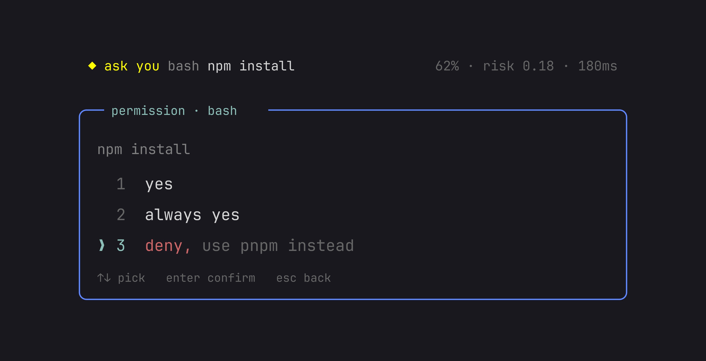

<h1 align="center">pi-ask-permission</h1>

<p align="center">
  <a href="https://github.com/felipeadeildo/pi-ask-permission/actions/workflows/ci.yml"></a>
  <a href="https://www.npmjs.com/package/pi-ask-permission"></a>
  <a href="https://www.npmjs.com/package/pi-ask-permission"></a>
  <a href="LICENSE"></a>
  <a href="https://www.npmjs.com/package/pi-ask-permission"></a>
  <a href="https://pi.dev/packages/pi-ask-permission"></a>
  <a href="https://pi.dev"></a>
</p>

Pi runs every tool call without asking. This extension asks first.

Answer `yes`, `always yes`, or `deny`, and add a note if you want. The note reaches the model with the result, so denying `npm install` with `use pnpm instead` corrects the agent without stopping it.

<p align="center">
  
</p>

## Install

```bash
pi install npm:pi-ask-permission
```

Then start pi as usual. There is nothing to configure.

## First run

Ask the agent to do something that writes, like `run the tests`. The dialog opens before the command runs:

```
╭─ permission · bash ──────────────────────────────────╮
│ pnpm test                                            │
│                                                      │
│ ❯ 1  yes                                             │
│   2  always yes                                      │
│   3  deny                                            │
│                                                      │
│ ↑↓ or 1-3 pick   enter confirm   tab note   esc deny │
╰──────────────────────────────────────────────────────╯
```

`enter` approves. `esc` denies. `tab` opens a note on the highlighted row.

Reads inside the project never ask. `read`, `grep`, `find`, `ls`, and bash commands that only read, like `cat`, `git log`, or `rg`, run on their own. An `edit` or `write` shows the diff it would make.

## Everyday use

### Stop answering the same question

Pick `always yes`, then choose how much to remember and for how long:

```
╭─ permission · bash ──────────────────────────────────╮
│ pnpm test                                            │
│                                                      │
│ always yes for...                                    │
│   pnpm                                               │
│ ❯ pnpm test                                          │
│                                                      │
│ scope: this session   (tab to change)                │
│                                                      │
│ ↑↓ depth   tab scope   enter confirm   esc back      │
╰──────────────────────────────────────────────────────╯
```

We recommend the narrowest level, which is preselected. `pnpm` would also approve `pnpm publish`.

| Scope        | Lasts                                    | Stored in                                                  |
| ------------ | ---------------------------------------- | ---------------------------------------------------------- |
| this session | until the session ends, reloads included | the session file                                           |
| this project | every session in this project            | `.pi/extensions/pi-ask-permission/always-yes.json`         |
| everywhere   | every session                            | `~/.pi/agent/extensions/pi-ask-permission/always-yes.json` |

Run `/perm forget` to drop this session's, or `/perm forget project` for the project's.

### Let the agent work

Press `Alt+M` to switch modes. The status bar shows the one you are in.

| Mode           | Runs without asking                  |
| -------------- | ------------------------------------ |
| `manual`       | nothing beyond reads and always yes  |
| `accept edits` | file edits and writes in the project |
| `auto`         | everything in the project            |

A call that leaves the project still asks, in every mode. The mode lasts for the session and never changes `config.json`.

### Correct the agent

A note on `deny` tells the agent what to do instead. A note on `yes` adds context, like `and update the snapshot`. Both reach the model with the tool result.

If you are typing in the editor when a call arrives, the dialog waits until you pause.

## Let a model decide

The judge answers first, and only the calls it is unsure about reach you. It is off by default. We recommend this setup:

1. Run `/login typesafe` to use Jev, a fast model that answers with a confidence. Any model you set up in pi works too.
2. Open `/perm`, turn on `Judge`, and turn on `Dry run`. The judge now shows its verdict as a card, and you still decide.
3. Pick a policy. `Standard development` allows edits, tests, builds, and local git, and asks about installs, network, and anything destructive.
4. After a few sessions of agreeing with it, turn off `Dry run`.

The policy is plain text, so you can start from a preset and edit it:

```text
# May run without asking
- Running tests, linters, type checks, and builds
- git status, diff, log

# Must always ask first
- sudo, or anything that changes system-wide state
- Anything that reaches the network

# When in doubt
Ask me.
```

If calls come back as `the judge could not decide`, run `/perm judge test`. It sends one request and reports the model, the latency, and the error.

## Commands

Type `/perm ` and the editor suggests the rest.

| Command                | Does                                                        |
| ---------------------- | ----------------------------------------------------------- |
| `/perm`                | Open the settings                                           |
| `/perm mode`           | Switch to the next mode (also `Alt+M`)                      |
| `/perm mode auto`      | Switch to a mode (also `manual`, `accept-edits`)            |
| `/perm status`         | Show the config, always yes, and file paths                 |
| `/perm forget`         | Forget this session's always yes                            |
| `/perm forget project` | Forget this project's always yes (also `everywhere`, `all`) |
| `/perm judge on`       | Turn the judge on (also `off`)                              |
| `/perm judge log`      | Show this session's judge decisions                         |
| `/perm judge test`     | Send one real request and report what happened              |

## Reference

### Dialog keys

| Key                    | Does                                                 |
| ---------------------- | ---------------------------------------------------- |
| `↑` `↓` or `1` `2` `3` | Move the highlight                                   |
| `enter`                | Confirm the highlighted row                          |
| `tab`                  | Open or close a note, or change the always yes scope |
| `esc`                  | Close the note, or deny                              |
| `ctrl+v`               | Paste a clipboard image as its file path             |

A long paste collapses to `[paste #1 +48 lines]` and expands when you confirm.

### Configuration

`~/.pi/agent/extensions/pi-ask-permission/config.json` is created on first run. Every key has a row of the same name in `/perm`.

```json
{
	"allow": ["read", "grep", "find", "ls"],
	"mode": "manual",
	"readOnlyBash": true,
	"notes": "result",
	"noUI": "deny",
	"workspace": { "roots": ["."], "outside": "ask" },
	"typing": { "pause": 1000, "maxWait": null },
	"judge": { "enabled": false }
}
```

| Key                 | Does                                                                                                                                   |
| ------------------- | -------------------------------------------------------------------------------------------------------------------------------------- |
| `allow`             | Tools that never ask. `mcp_*` matches a family. It matches the tool name, so `bash` allows every command                               |
| `mode`              | The mode a new session starts in                                                                                                       |
| `readOnlyBash`      | Run bash commands that only read without asking                                                                                        |
| `notes`             | `"result"` adds a note to the tool result. `"message"` sends it as its own message                                                     |
| `noUI`              | `"allow"` or `"deny"` when nobody can answer, as in print mode or a subagent. Takes a per-tool map: `{ "*": "allow", "bash": "deny" }` |
| `workspace.roots`   | Paths that count as the project. Relative, absolute, and `~` work                                                                      |
| `workspace.outside` | A call outside the roots: `"ask"` you, `"deny"` it, or `"allow"` it like any other                                                     |
| `typing.pause`      | Milliseconds of quiet before the dialog opens while you type                                                                           |
| `typing.maxWait`    | The longest the dialog waits for you to stop typing. `null` waits forever                                                              |

The `judge` block:

| Key                 | Default        | Does                                                  |
| ------------------- | -------------- | ----------------------------------------------------- |
| `enabled`           | `false`        | Turn the judge on                                     |
| `provider`          | `"jev"`        | `"jev"`, or `"pi"` for a model you set up in pi       |
| `model`             | `"jev-latest"` | A Jev alias, or `provider/modelId` for a pi model     |
| `tools`             | `["bash"]`     | Tools the judge decides. The rest ask you             |
| `policy`            | Standard       | The rules the judge follows                           |
| `canDeny`           | `true`         | A confident no blocks the call. Off, it asks you      |
| `whenUnsure`        | `"ask"`        | `"ask"`, `"allow"`, or `"deny"`                       |
| `whenItFails`       | `"ask"`        | The same, for a timeout, an error, or a missing key   |
| `alwaysAsk`         | `[]`           | Patterns the judge never approves, like `"git push*"` |
| `dryRun`            | `false`        | Show the verdict, and still ask you                   |
| `noUI`              | `false`        | Also judge print, JSON, and subagent runs             |
| `rememberApprovals` | `false`        | A judge approval becomes always yes for this session  |
| `thresholds`        | `0.85` / `0.8` | Confidence needed to allow / deny                     |
| `riskCeiling`       | `0.45`         | Highest risk the judge may approve                    |
| `timeoutMs`         | `5000`         | How long to wait for an answer                        |

The file carries the full `judge` block. A malformed file falls back to the defaults and says what it dropped, so a typo never lets more through. A file from before 3.0 is rewritten with the new names on first load. `PI_CODING_AGENT_DIR` moves the file with the rest of the agent directory.

### How a call is decided

The first step that answers wins.

1. **Always yes** matches the tool and level: run it.
2. **Workspace**: a call outside `workspace.roots` asks you, or is blocked with `outside: "deny"`. Nothing below can approve it.
3. **Mode**: `auto` runs it, `accept edits` runs an edit.
4. **Allow list**: the tool is in `allow`, run it.
5. **Read-only bash**: the command only reads, run it.
6. **Judge**: a confident yes runs it, a confident no blocks it.
7. **No UI**: `noUI` decides.
8. **Edit check**: an `edit` that cannot apply is blocked with pi's own error, so you never approve a failure.
9. **You**, in the dialog.

The judge answers three questions: a verdict, how reversible the call is, and whether it touches secrets. Code combines them into `risk = 0.6 × reversibility + 0.4 × sensitive` and approves only when the verdict is `allow`, confidence clears `thresholds.allow`, and risk is at most `riskCeiling`. The judge treats the tool call as data, so a command cannot talk its way past the policy or `alwaysAsk`.

### Limits

- Always yes matches text. `cd /repo && pnpm test` offers `cd`, `cd /repo`, and the whole line, not `pnpm test`.
- A bash path the check cannot read counts as outside. `$HOME`, `$SECRET`, and `"$@"` ask for that reason.
- The read-only check is a classifier, not a sandbox. It trusts the command name as written and does not resolve `PATH`. It refuses anything it cannot prove harmless, so a few safe commands still ask.
- The judge is a model, and it can be wrong. It sees the tool call, so do not judge calls that carry secrets you would not send to its provider.
- If you want deterministic rules and no human in the loop, use a sandbox instead.

### For other extensions

Every decision goes out on `pi.events`:

```ts
pi.events.on("pi-ask-permission:decided", (decided) => {
	// { toolCallId, toolName, summary, action: "allow" | "block", by, reason?, note? }
});
```

`by` names the step above that decided, `you` for the dialog, or `no UI`. Dialog answers are also saved in the session as `pi-ask-permission:answer` entries.

A custom tool can say what it touches, so the workspace and `accept edits` treat it like `edit`. Emit from `session_start`, after every extension has loaded:

```ts
pi.on("session_start", () => {
	pi.events.emit("pi-ask-permission:tool", {
		name: "apply_patch",
		edits: true,
		paths: (input) => input.files,
	});
});
```

A tool that says nothing has no paths and is not an edit. Built-in tools cannot be redescribed.

### Compatibility

Tested against the pi SDK pinned in `devDependencies`, which the `pi SDK` badge shows. CI checks each new pi release. The peer range is `*` because pi, not npm, picks the SDK that loads the extension.

## Contributing

See [CONTRIBUTING.md](CONTRIBUTING.md). Commits follow [Conventional Commits](https://www.conventionalcommits.org), and [release-please](https://github.com/googleapis/release-please) publishes.

## License

[MIT](LICENSE) © Felipe Adeildo
